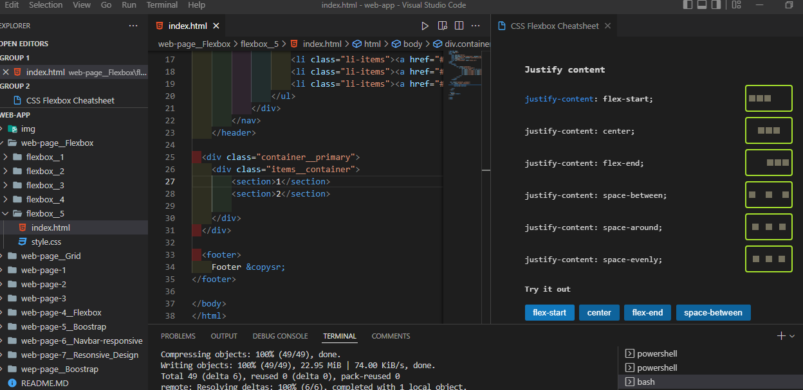

## Maquetado en HTML Y ESTILO EN CSS
### 3 web page con sus respectivos diseños
>Inluye:
>>codigo, imagenes, y carpetas

Web App Secondary

Web App Video Play

# No Responsign
# Responsive
### Flexbox
>Inluye:
>>codigo, imagenes, y carpetas

Web App Flexbox